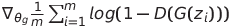

# Generative Adversarial Networks

## Reference Paper
- "Generative Adversarial Networks." Ian J. Goodfellow, Jean Pouget-Abadie, Mehdi Mirza, Bing Xu, David Warde-Farley, Sherjil Ozair, Aaron Courville, Yoshua Bengio. ArXiv 2014.

## Ý tưởng chính

GAN là lớp mô hình có mục tiêu là tạo ra dữ liệu giả giống với thật. GAN là một mạng sinh đối nghịch bởi kiến trúc của nó bao gồm hai mạng có mục tiêu đối nghịch nhau đó là Generator và Descriminator.

- Mạng Generator: Có nhiệm vụ sinh ra các dữ liệu giả để đánh lừa được mạng Discriminator. Đầu vào của mạng Generator là một tập hợp các vector nhiễu z được khởi tạo ngẫu nhiên theo phân phối Gaussian.
- Mạng Discriminator: Có nhiệm vụ phân biệt ảnh đầu vào là ảnh thật hay ảnh giả. Nhãn của mô hình sẽ là thật nếu ảnh đầu vào của Discriminator được lấy tập mẫu huấn luyện và giả nếu được lấy từ đầu ra của mô hình Generator.

## Thuật toán của mô hình
Thuật toán dùng để tối ưu trong bài báo

Trong quá trình huấn luyện ta kết hợp xen kẽ giữa Generator và Discriminator. *Ta kí hiệu  $k$ là số* bước đồng thời cũng là $k$ batch đầu tiên áp dụng huấn luyện cho mạng Discriminator

**Chi tiết giải thuật**

**Huấn luyện cho Discriminator*

1. Lấy mẫu một mini-batch có kích thước m là các nhiễu  và là đầu vào của mạng Generator. 
    
    Đồng thời lấy một mini-batch khác có kích thước m là các điểm dữ liệu thật .
    
2. Cập nhật tham số mạng Discriminator bằng cách Lên đồi bằng đạo hàm theo công thức:
    
    
    
3. Lặp lại từ **bước 1** cho đến hết $k$ bước ở mạng Discriminator.

*Do là huấn luyện trên mạng Discriminator nên chỉ được cập nhật các hệ số trên mạng Discriminator là . Các hệ số của mạng Generator được giữ nguyên.*

*Huấn luyện cho mạng Generator

Sau khi kết thúc k batch huấn luyện cho mạng Discriminator, ta tiếp tục huấn luyện trên Generator

4. Lấy một mini-batch kích thước m lựa chọn từ các nhiễu  .
5. Cập nhật tham số của mạng Generator bằng cách Xuống đồi bằng đạo hàm theo công thức:
    
    
    
6. Lặp lại từ **bước 1** cho đến hết số lượt Training

*Quá trình cập nhật bằng Xuống đồi bằng đạo hàm chỉ được áp dụng trên các hệ số của Generator là . Tiếp tục quá trình này cho tới khi tổng số lượt huấn luyện là đủ lớn hoặc loss của mô hình tiệm cận về 0.*

## Quá trình huấn luyện

- Bước transform dữ liệu
    - Tải tập dữ liệu MNIST và FashionMNIST
    - Bởi quá trình cài đặt sử dụng Pytorch nên sẽ cần có bước transform để có thể chuyển sang dạng FloatTensor để Pytorch có thể xử lý được
    - Sử dụng DataLoader để chia tập dữ liệu thành các batch nhỏ giúp huấn luyện dễ dàng hơn so với huấn luyện toàn tập ảnh trong 1 lần
- Chuẩn bị và khai báo các mạng Discriminator và mạng Generator
    - Mạng phân biệt - Discriminator
        - Đầu vào là ảnh trainning hoặc ảnh sinh có kích thước là 28x28, đầu ra là label 0 hoặc 1
        - Mạng sử dụng mô hình hồi quy tuyến tính - Linear Regression để huấn luyện
        - Đi kèm là hàm kích hoạt Leaky ReLU
        - Sử dụng thêm hàm Dropout để hạn chế bị overfitting
    - Mạng sinh - Generator
        - Đầu vào là vector nhiễu có kích thước 100, đầu ra là ảnh sinh có kích thước 28x28
        - Giống với mạng Discriminator cũng sử dụng mô hình Linear Regression cùng với hàm kích hoạt Leaky ReLU
        - Sử dụng thêm hàm kích hoạt Tanh tại lớp cuối cùng để tăng khoảng giá trị đầu ra lên khoảng [-1, 1]
- Quá trình huấn luyện
    
    Quá trình huấn luyện cho mạng Discriminator và mạng Generator diễn ra đồng thời trong 1 epoch.
    
    - Quá trình huấn luyện mạng Discriminator
        - Tính hàm loss của Discrimtator dựa trên ảnh gốc trong tập ảnh test
        - Tiến hành sinh ảnh giả
        - Tính hàm loss của mạng Discrimination trên ảnh giả
        - Cộng kết quả 2 hàm loss khi tính trên ảnh thật và ảnh sinh
        - Thực hiện lan truyền ngược và tối ưu để cập nhật tham số cho mạng Discriminator
    - Quá trình huấn luyện mạng Generator
        - Sinh ảnh giả
        - Tính hàm loss của mạng generator
        - Thực hiện lan truyền ngược và tối ưu để cập nhật tham số cho mạng Generator
    - Lưu lại kết quả mất mát và hình ảnh được mạng generator sinh ra phục vụ cho việc đánh giá và thống kê

## Kết quả huấn luyện
Kết quả đều được huấn luyện trong 100 epoch
- **Kết quả trainning trên tập ảnh MNIST**
    - Tập dữ liệu sinh mỗi 10 epoch
    
    
    
    - Kết quả của hàm mất mát trên 2 mạng
    
    
    
- **Kết quả huấn luyện trên tập dữ liệu FashionMNIST**
    - Tập dữ liệu sinh mỗi 10 epoch
        
        
        
    
    - Kết quả của hàm mất mát trên 2 mạng
        
        
